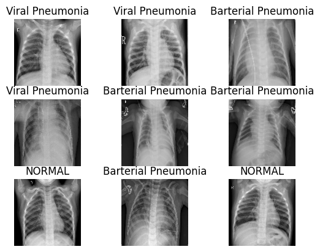
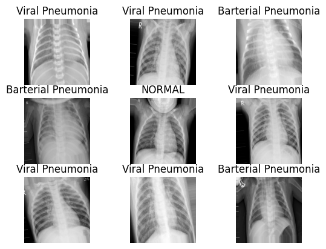
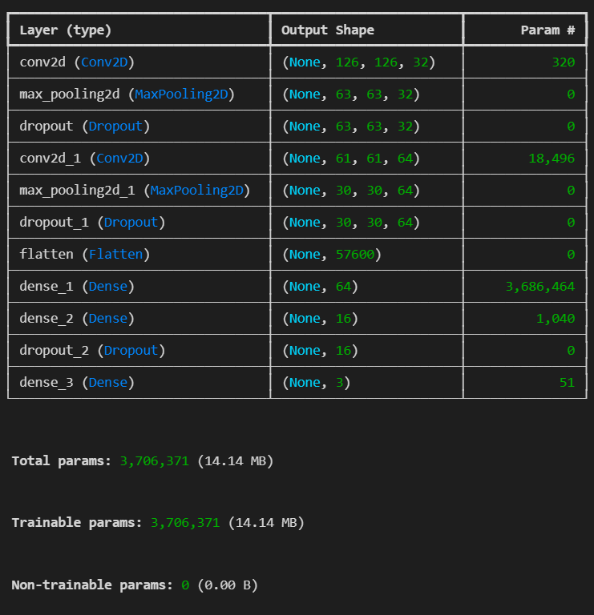
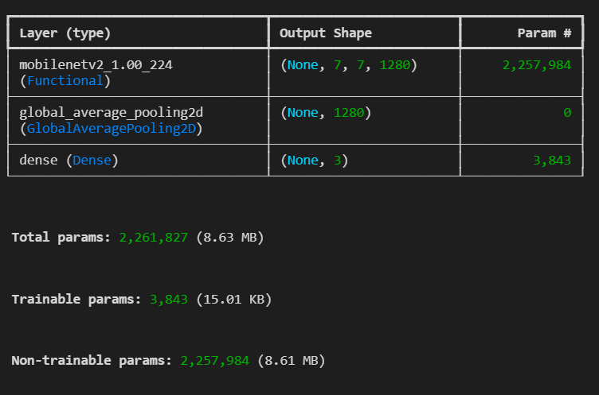
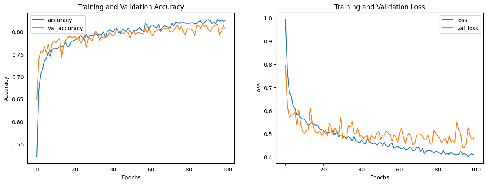
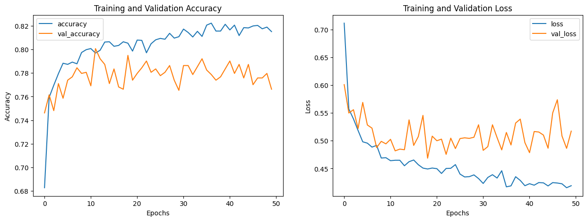
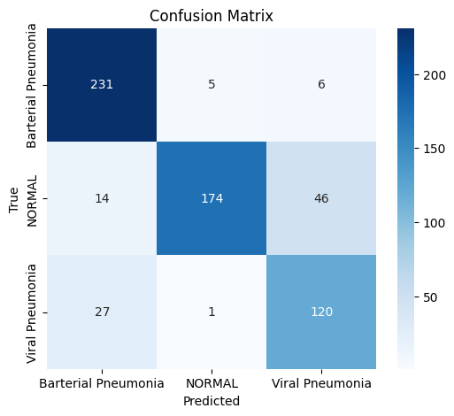
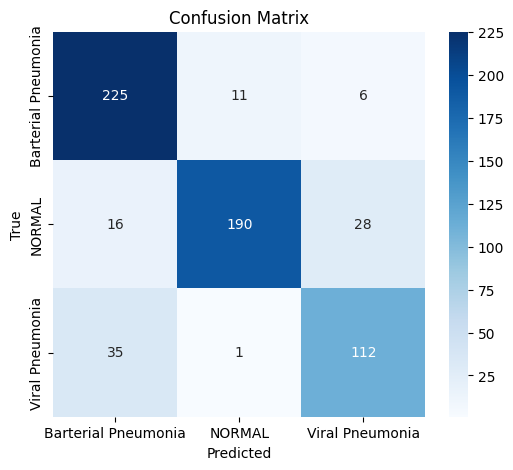
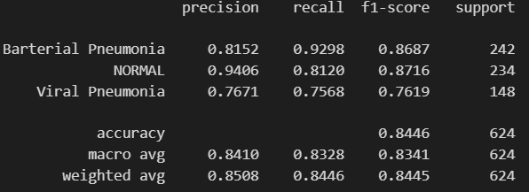

# Medical Imaging
## Penumonia Chest X-Rays Classification

In this project, Pneumonia Chest X-rays Dataset is used. This dataset consists of images from normal and pneumonia X-ray. The pneumonia also consists of two types, they are bacterial and viral pneumonia. In this project, a model will be built to classify the dataset into three classes. There are several steps that need to be done that will be explained as follows. 

### Data Exploration and Organizing

From the original dataset, we will get a folder with a structure as follows: 

<pre> chest_xray/ 
  ├── test/ 
  │ ├── NORMAL/ 
  │ └── PNEUMONIA/ 
  ├── train/ 
  │ ├── NORMAL/ 
  │ └── PNEUMONIA/ 
  ├── val/ 
  │ ├── NORMAL/ 
  │ └── PNEUMONIA/ </pre>
  
Because we want to classify the data into 3 classes, so we need to split the PNEUMONIA folder into 2 folders, they are bacterial pneumonia and viral pneumonia. The bacterial pneumonia will be moved to the Bacterial Pneumonia folder, and viral pneumonia will also be moved to the Viral Pneumonia folder. So that the structure will look like this: 

<pre> chest_xray/ 
  ├── test/ 
  │ ├── NORMAL/ 
  │ └── Bacterial Pneumonia/ 
  │ └── Viral Pneumonia/ 
  ├── train/ 
  │ ├── NORMAL/ 
  │ └── Bacterial Pneumonia/ 
  │ └── Viral Pneumonia/ 
  ├── val/ 
  │ ├── NORMAL/ 
  │ └── Bacterial Pneumonia/ 
  │ └── Viral Pneumonia/ </pre>
  
This action need to be done, so that it will be easier to label the data based on the folder name, instead of the long filename. 
After that, all of the image data will be stored into grayscale for the input to the model later. This action was done using OpenCV library and the image were also resized using the same library into 128x128 size.  The sample of the data can be seen in the picture below:

### Data Pre-processing

The data then need to be reshaped so that they have channel for the input to the model later. Then, rescaling will be conducted to normalize the pixel value into 0-1 by dividing it by 255, which is the maximum value of the pixel value in grayscale. 
Based on the folder before, we can see that we have 3 sets, they are train, test, and val. But in this dataset, the validation folder does not consist of many data. It has only 8 normal data, 8 bacterial pneumonia data, and 0 viral pneumonia data. So, the folder will not be used. From the training folder, the data will be randomly split into training and validation data with the ratio of 80%:20%. So, the training data consists of 4172 data, validation data consists of 1044, and also the test data consists of 624 data. From the training data, we have 2024 samples of bacterial pneumonia, 1027 samples of normal, and 1076 samples of viral pneumonia data. 
Because the dataset is not big enough, so data augmentation will be conducted. This data augmentation process consists of several operations, they are random rotation, random width and height shift, and also random zooming. The samples of data that has been augmented can be seen in the picture below.  

### Training and Testing Model 

The data in this project is medical image, so the model that commonly use is convolutional neural network (CNN). Here, a custom CNN model is built and also the data will also be trained using a pre-trained model, MobileNet. The architecture of the CNN and MobileNet model can be seen in the pictures below. 

Both model will be trained with categorical crossentropy loss function and adam optimizer. The CNN was trained using 100 epochs and MobileNet model was trained using 50 epochs. Both training results can be seen in the pictures below, respectively.

As we can see, the result from custom CNN model is convergently going down for both training loss and validation loss, also up for training accuracy and validation accuracy. Furthermore, the MobileNet result, it shows overfitting after around 20 epochs. Other than that, the training time od CNN model is faster than MobileMet. This can be caused by the model parameters in MobileNet that is larger than in the CNN model. CNN model only needs 2136s, but the MobileNet needs 3741s to be trained with half of the epoch in the CNN. 
Testing was done to both models using the testing data. The result of the testing can be seen in the table below. 

| Model | Accuracy | Loss |
|---------|-------------|-------|
| CNN | 84.13% | 0.6193 |
| MobileNet | 84.46% | 0.5045 |

The confusion matrix for both CNN and MobileNet testing result are shown in the pictures below. 

Other than that, the classification report for both models is also shown in the pictures below. 

Based on the testing result, we can see that MobileNet model has slightly higher accuracy and lower loss. It means that there are more data that correctly predicted by the MobileNet model than CNN model. 
But, based on the confusion matrix and also the classification report, we can see that the sensitivity or recall for bacterial and viral pneumonia in CNN model is higher than in MobileNet. It means MobileNet is more sensitive to the normal data than to pneumonia data. But in this kind of case, we need to decide what do we need to prioritize. Because it’s medical imaging classification, so we need to avoid false negative (FN) in our prediction. False negative (FN) is the positive data that is predicted as negative. For example, if the data is actually part of bacterial pneumonia, but predicted as other classes. So, it’s better to choose a model with lower FN for the bacterial and viral pneumonia. This can be shown by the sensitivity or recall value from the classification report and CNN model has higher sensitivity to both classes. So, CNN model can be taken into consideration although has lower accuracy. But MobileNet is also can be improved by tuning the hyperparameters. 

### Epoch Variation

Number of epoch variation is also used to the CNN model. The model will be trained using 25 and 50 epochs. The result of the testing can be seen in the table below. 

| Number of Epoch | Accuracy | Loss |
|-----------------------|-------------|-------|
| 25 | 82.53% | 0.6727 |
| 50 | 81.41% | 0.8141 |
| 100 | 84.13% | 0.6193 |

As we can see, the accuracy in the model with 25 epochs is lower than the model with 100 epochs but higher than the model with 50 epochs. The loss is also higher than the model with 100 epochs, but lower than the model with 50 epochs. This can happen because the training is stochastic, which is randomized batched, dropout, and augmentation. So, dips and recoveries or the fluctuation throughout the training process is normal. So, the possibility is in 50 epochs the training process is oscillating. 
